# Lab-1: Capacity Planning using OMAT (Oracle Migration Assistant Tool) for Azure

## Pre-requisites
- PowerShell 5.1 or above is required. PowerShell 5.1 comes preinstalled with Windows 10 and Windows 11. For more information refer to https://learn.microsoft.com/en-us/powershell/scripting/windows-powershell/install/installing-windows-powershell
- Azure CLI 2.40 or or above is required. Setup script will automatically install the latest version or you can manually install Azure CLI from https://learn.microsoft.com/en-us/cli/azure/install-azure-cli-windows?tabs=azure-cli
- Excel 2019 or above is required

## Introduction
Oracle Migration Assistant Tool (OMAT) helps to understand resource usage on Oracle installations (on premise or in any cloud) and recommend the most suitable virtual machine that can run the same on Azure.

It works by processing Automatic Workload Repository (AWR) reports collected from the source system. Required data is extracted from AWR files and placed into an Excel workbook. For more information on different sections of workbook and the algorithm behind calculations see AWR sizing document.

OMAT essentially automates steps defined in the AWR sizing document to speed up the process and to relieve user from complexities of interpreting the AWR report.

## Lab Exercises

### Clone Lab Repository
- Clone the repository to your local machine or download the zip file and extract it to a local folder.
```powershell
git clone https://github.com/Azure/Oracle-Workloads-for-Azure.git
```
### Configure OMAT
- Run PowerShell in Administrator mode.

- Give necessary permissions
```powershell
Set-Location <YOUR_LOCAL_FOLDER>\Oracle-Workloads-for-Azure\omat
Set-ExecutionPolicy -ExecutionPolicy Unrestricted -Scope CurrentUser

Unblock-File -Path .\omat.ps1
Unblock-File -Path .\template.xlsm
```

### Processing AWR Files
- Login to Azure CLI. This is used to target an Azure region when generating Azure resource recommendations including resource pricelist. If you have multiple Azure subscriptions in your tenant, specify the subsription you would like to use below.

```powershell
az login --use-device-code

az account set --subscription <YOUR-SUBSCRIPTION-ID>
```

- First step for using OMAT is to collect AWR reports from the source Oracle database. AWR reports can be collected using Oracle Enterprise Manager (OEM) or manually using SQL*Plus. 

- In this lab, we will use AWR reports collected from a sample database. AWR reports are available in the folder <YOUR_LOCAL_FOLDER>\Oracle-Workloads-for-Azure\levelup-oracle-on-iaas\lab1\awr.
- In the command-line parameter -AzureRegion, specify the Azure region which would be targeted when generating Azure resource recommendations.

```powershell
.\omat.ps1 -SourceFolder "<YOUR_LOCAL_FOLDER>\Oracle-Workloads-for-Azure\levelup-oracle-on-iaas\lab1\awr" -AzureRegion <AZURE-REGION>
```
The example below uses the East US region as the target Azure region.
```powershell
Connected to subscription '<your-subscription-name>' (XXXXXXXX-XXXX-XXXX-XXXX-XXXXXXXXXXXX) as '<your-user-name>'
Using Azure region 'eastus'
Processing files from directory : <YOUR_LOCAL_FOLDER>\Oracle-Workloads-for-Azure\levelup-oracle-on-iaas\lab1\awr
Using template file             : <YOUR_LOCAL_FOLDER>\Oracle-Workloads-for-Azure\omat\template.xlsm
1-Processing file : <YOUR_LOCAL_FOLDER>\Oracle-Workloads-for-Azure\levelup-oracle-on-iaas\lab1\awr\AWR_DBS.html
2-Processing file : <YOUR_LOCAL_FOLDER>\Oracle-Workloads-for-Azure\levelup-oracle-on-iaas\lab1\awr\AWR_DBT.html
3-Processing file : <YOUR_LOCAL_FOLDER>\Oracle-Workloads-for-Azure\levelup-oracle-on-iaas\lab1\awr\AWR_DBU.html
4-Processing file : <YOUR_LOCAL_FOLDER>\Oracle-Workloads-for-Azure\levelup-oracle-on-iaas\lab1\awr\AWR_DBV.html
5-Processing file : <YOUR_LOCAL_FOLDER>\Oracle-Workloads-for-Azure\levelup-oracle-on-iaas\lab1\awr\AWR_DBW.html
6-Processing file : <YOUR_LOCAL_FOLDER>\Oracle-Workloads-for-Azure\levelup-oracle-on-iaas\lab1\awr\AWR_DBX.html
7-Processing file : <YOUR_LOCAL_FOLDER>\Oracle-Workloads-for-Azure\levelup-oracle-on-iaas\lab1\awr\AWR_DBY.html
8-Processing file : <YOUR_LOCAL_FOLDER>\Oracle-Workloads-for-Azure\levelup-oracle-on-iaas\lab1\awr\AWR_DBZ.html
Exporting to Excel...
Exporting tables ...
Fetching pricelist for eastus in USD. This operation takes a while.
Populating AzurePriceList table...
Fetching available Azure VM and Disk Skus in eastus. This operation takes a while.
Populating AzureVMSkus table...
Populating AzureDiskSkus table...
Refreshing recommendations...
Finished processing files from directory : <YOUR_LOCAL_FOLDER>\Oracle-Workloads-for-Azure\levelup-oracle-on-iaas\lab1\awr in 105.784239 seconds
Open the Excel file "<YOUR_LOCAL_FOLDER>\Oracle-Workloads-for-Azure\levelup-oracle-on-iaas\lab1\awr\AWR.xlsm" to review recommendations.
Note macros are required to be enabled in Excel. See following link to enable macros: https://support.microsoft.com/en-us/office/enable-or-disable-macros-in-microsoft-365-files-12b036fd-d140-4e74-b45e-16fed1a7e5c6
```

> As indicated in the output above, Excel file is generated in the same folder as the AWR reports and requires [macros to be enabled in Excel](https://support.microsoft.com/en-us/office/enable-or-disable-macros-in-microsoft-365-files-12b036fd-d140-4e74-b45e-16fed1a7e5c6). 

> If you would like to skip this step you may use the Excel file [Lab1-SampleOutput.xlsm](./lab1/Lab1-SampleOutput.xlsm), which is already created using the same process. 

# Generating Recommendations 

## Scenario 1: Consolidate all databases into a single VM

Once you created the Excel file, you can work with the file offline to generate recommendations for different scenarios and requirements.

- Open the Excel file **<YOUR_LOCAL_FOLDER>\Oracle-Workloads-for-Azure\levelup-oracle-on-iaas\lab1\awr\AWR.xlsm** to review recommendations.

- Switch to **Data** worksheet. This worksheet contains the data extracted from AWR reports. AWR Details table contains a line for each database for standalone databases and a line for each database and node for RAC databases.

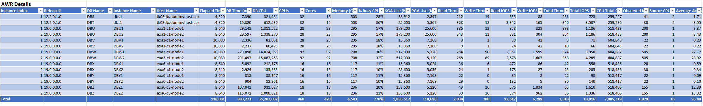

- Scroll down to "Summary by Database Instance" which aggregates performance metrics in **AWR Details** table per instance (by database name and instance name). You can use it to understand if there is any skew across different instances or if workload is homogeneously distributed.

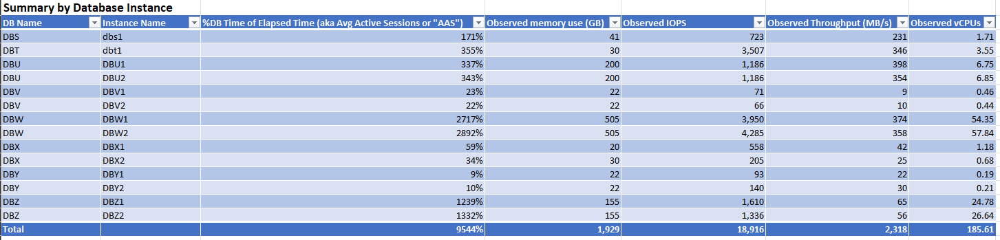

- Scroll down to "Summary by Host Server" table which aggregates performance metrics in **AWR Details** table per host server. You can use it to understand if there is any skew across different hosts (in case of RAC deployments) or if workload is homogeneously distributed.

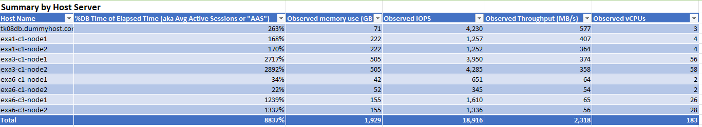

- Scroll down to "Summary by Database" table which aggregates data **AWR Details** table per database. "Summary by Database" table is the basis for all recommendations in the recommendations sheet. Observed performance values are aggregated by database and estimations are calculated using parameters in "Settings" sheet.

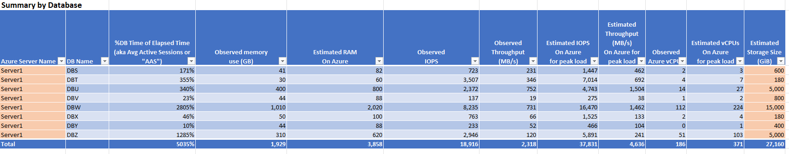

- In "Summary by Database" table, you have to modify two columns

  - "Azure Server Name" column determines the name of Azure VM this database is migrated into. By default, all databases are migrated to "Server1". For this step, leave "Azure Server Name" values intact and move to the next step.

   - "Estimated Storage Size (GiB)" determines how much storage is needed for this database. Database file sizes are not part of AWR report. You can run [dbspace.sql](https://github.com/Azure/Oracle-Workloads-for-Azure/blob/main/az-oracle-sizing/dbspace.sql) file or use manual methods to retrieve database size and update "Summary by Database" table. 

      For this lab, the output of [dbspace.sql](https://github.com/Azure/Oracle-Workloads-for-Azure/blob/main/az-oracle-sizing/dbspace.sql) for each database is given in the respective ".lst" file under the same folder as the AWR reports. 

      **<YOUR_LOCAL_FOLDER>\Oracle-Workloads-for-Azure\levelup-oracle-on-iaas\lab1\awr**

       Look at the output of dbspace.sql for each database and populate "Estimated Storage Size (GiB)" column in "Summary by Database" table. Note that dbspace.sql output contains database size as well as backups. In this lab, we will use database size only. Also note that, you would not want to use the exact size of the database files on the source system for sizing purposes. You should consider the growth of the database over time and size the target system accordingly. In this lab we have rounded up measured database size approximately 20% to account for growth.

       To retrieve the database size from dbspace.sql output, look at the first table output and note down the value in the line that is starts with "sum", as in the example below. Note that the value given here is in mega bytes.

        ```sql
        BCTfile               0.00
        Ctlfile              37.44
        Datafile        408,178.97
        OnlineRedo        3,072.00
        Tempfile         86,359.97
                   ---------------
        sum             497,648.38
        ```
     
- Next, move to "Recommendations" sheet and click "Refresh Recommendations" to generate recommendations based on the data in "Summary by Database" table.


- The first table in recommendations sheet shows performance metrics required for each Azure VM as well as databases migrated into each VM. 

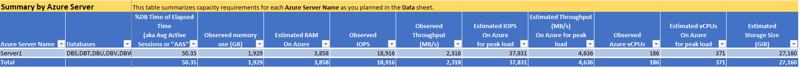

  This table basically shows that we are moving all databases to a single VM on Azure and that VM and storage has to provide a total capacity of 3858GB RAM, 37831 IOPS, 4636 MB/s IO throughput and 371 vCPUs.

- Next table shows the recommended VMs for above requirements. Since, vCPU requirement is high, there is really only one option that can provide >371 vCPUs.

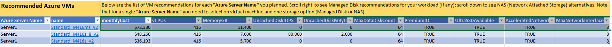

- Next table shows the recommended VMs for above requirements. Since, vCPU requirement is high, there is really only one option that can provide >371 vCPUs.


- For storage options, the recommendations are network-based storage options, e.g., Azure NetApp Files (ANF) or Azure Elastic SAN (Preview). Although these storage options can support the databases' combined IO throughput of 4,636 MB/s, none of the recommended Mv2-series VMs could sustain the required IO throughput over its network bandwidth. Refer to the [Mv2-series features](https://learn.microsoft.com/en-us/azure/virtual-machines/mv2-series). The column to focus on is "Expected network bandwidth (Mbps)" because network-based storage utilizes network bandwidth. Each of the recommended Mv2-series VMs only support expected network bandwidth of 32,000 Mbps or 4,000MB/s. The VM would be throttled if the actual network bandwidth exceeds the published network bandwidth limit and the consequence of throttling is very severe to the database workload.

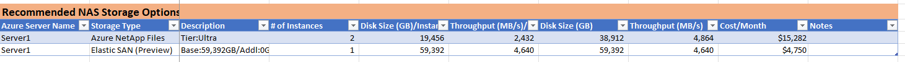

## Scenario 2: Consolidate databases on 3 VMs

- If you look at the list of databases we have, we can see that 2 databases require significantly more resources than others. In those cases you may want to move those databases to a separate VM.

- Navigate to "Data" sheet and scroll down to "Summary by Database" table.

- Update "Azure Server Name" column for database "DBU" to "Server2" and "DBW" to "Server3" respectively.

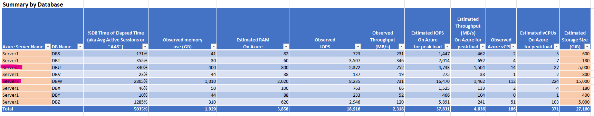

- Navigate back to "Recommendations" sheet and click "Refresh Recommendations".

- Now, you can see that we have 3 VMs with 2 VMs having 1 database each and 1 VM having 6 databases.

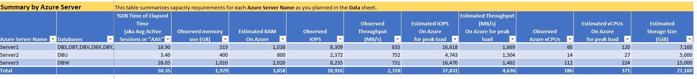

- Our recommendation for VMs also has various options for each VM in the "Summary by Database" table. 

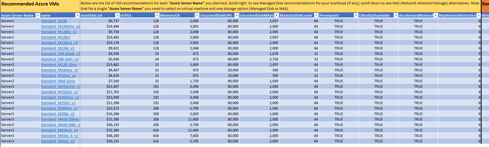

- For each VM SKU, following meta data is provided. Note that this meta data is extracted Azure RM
  - Azure Server Name
  - name
  - monthlyCost
  - vCPUs
  - MemoryGB
  - UncachedDiskIOPS
  - UncachedDiskMBytesPerSecond (Note that call value is in bytes/sec and just reformatted to show in thousands)
  - MaxDataDiskCount
  - PremiumIO
  - UltraSSDAvailable
  - AcceleratedNetworkingEnabled
  - MaxNetworkInterfaces

- If you click on the hyperlink in the "name" column, you can see the details of the VM SKU in "AzureVMSkus" worksheet. Now click on the hyperlink that reads "Standard_E104ids_v5" in the "name" column to see metadata for "Standard_E104ids_v5".

- Each VM recommendation also has various options for storage. First, managed disk options are given in table to the right.

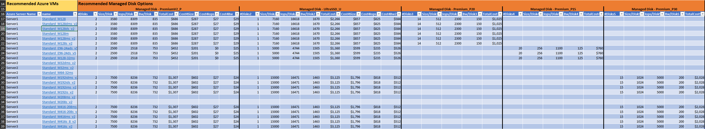

- Since managed disks are limited by the I/O Throughput and # of disks supported by the VM SKU, managed disk options are given for each VM SKU separately

- As a best practice, OMAT calculates 3 alternatives for each VM SKU as applicable.
  - Premium v2 SSD
  - Ultra SSD
  - Premium v1 SSD (Note that it calculates all alternatives for Premium v1 disk SKUs and presents here the least expensive option)

> [!Important]
> 
>  It is a best practice to use multiple data disks and stripe them together to get a combined higher IOPS and throughput limit. This is done by [striping the data disks](https://learn.microsoft.com/en-us/azure/virtual-machines/premium-storage-performance#disk-striping) together to aggregate their IOPs, throughput and storage capacity. There are 2 striping techniques usually used for Oracle databases. Oracle database administrators and practitioners are very familiar with Oracle Automatic Storage Management (ASM). See this [article](https://learn.microsoft.com/en-us/azure/virtual-machines/workloads/oracle/configure-oracle-asm) for more details. Besides Oracle ASM, customers who are familiar with LVM on Linux, they could [configure LVM](https://learn.microsoft.com/en-us/previous-versions/azure/virtual-machines/linux/configure-lvm) on Linux VMs in Azure.
 
- Now compare two recommendations for Server3 on lines 32 (name = Standard_M192is_v2) and 33 (name = Standard_M208ms_v2). Why do you think there are no managed disk recommendations for the VM SKU on line 33?

- Similarly, compare recommendations for Server1 on line 22 and Server2 on line 23. Why do you think OMAT recommends Premium v1 P20 SKU for the first one but Premium v1 P15 for the second? Please note that the default OMAT recommendations are based on least-expensive options. You can clear the filter on "Best Practices Only" and select "All Others", select different disk options according to the customer's requirements. For example customer may choose to stripe fewer but larger premium SSD disks to reduce operational complexity. The tool would provide recommended disks that fit the workload requirements in terms of IOPS and throughput.  

- For each managed disk option, following metadata is provided
  - #Disks: Total # of disks required. Note that this number cannot be larger than max # of disks supported by the VM SKU.
  - Size/Disk: Size of each disk. In GiB.
  - Iops/Disk: IOPS provided by each disk.
  - Bw/Disk: IO bandwidth (throughput) provided by each disk, in MB/sec.
  - TotalCost: Total cost of storage for all disks. For Ultra SSD and PRemium SSD v2, the breakdown for this cost is given in the following columns. 
  - Cost4Size: Cost of storage for all disks, based on size.
  - Cost4Iops: Cost of storage for all disks, based on IOPS.
  - Cost4Bw: Cost of storage for all disks, based on bandwidth.

- If we scroll down to "Recommended NAS Storage Options" we notice that there are two alternatives for NAS storage: ANF and ESAN.

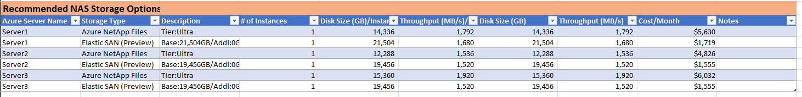

- Following information provided for each recommendation 

  - Azure Server Name
  - Storage Type
  - Description: provides details of configuration. For ANF, it is the ANF tier to be used; fo ESAN it is the amount of base storage and additional storage to be used.
  - \# of Instances: the number of instances/volumes of the storage option to be used. 
  - Disk Size (GB)/Instance: Disk size per instance/volume
  - Throughput (MB/s)/Instance: Throughput per instance/volume
  - Disk Size (GB): Total disk size
  - Throughput (MB/s): Total throughput
  - Cost/Month: Total cost
  - Notes

## Scenario 3: Fine tune recommendations by changing factors

- Capacity planning is an art as well as science. Although we base our planning on actual metrics from source system, we still need to plan with a buffer.

- If you look at the Summary by Database table, actual measured values are given in "Observed ..." columns. Then we apply a factor to these values and base our planning process to calculated values are given in "Estimated ..." columns.


- Check the difference between Observed and Estimated values to note the difference.

- There are separate factors for each metric as given in OMAT settings

  - Est'd Peak CPU factor
  - Est'd Peak RAM factor
  - Est'd Peak I/O factor

- Default values for all these factors are 2. Meaning, for example, if we measured the requirement to be 10 vCPUs, we will plan for 20 vCPUs.

- This default value is a safe starting point, but may not be suitable for every scenario.

- Navigate to "Settings" sheet and change values of CPU, RAM and IO factors from 2 to 1.2, so that our planned buffer is 20% instead of 100%.

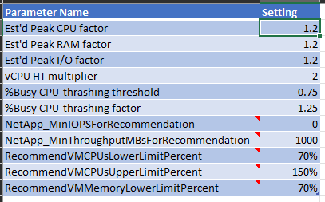

- Navigate back to "Recommendations" sheet and click "Refresh Recommendations".

- Note that the difference between Observed and Estimated values are now smaller (1.2x).

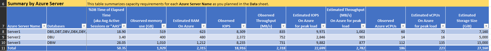

- Recommended VM SKUs, managed disks and network storage are also lower SKUs and capacity than previous recommendations. 

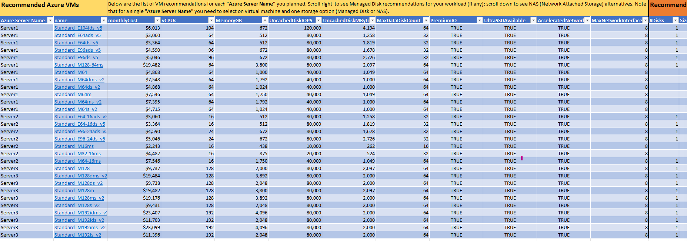
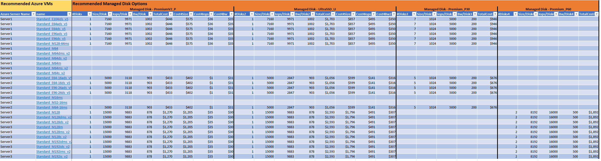
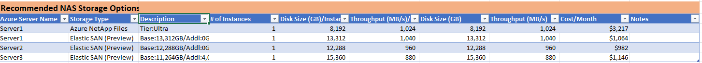

- You should have noticed that ANF recommendation is generated only one VM and not the other two. The reason for this is that OMAT uses two settings to determine if IO throughput requirement is high enough to justify using ANF. These settings are given in "Settings" sheet.

  - NetApp_MinIOPSForRecommendation: Default 0, means do not use this setting.
  - NetApp_MinThroughputMBsForRecommendation: Default 1000, means ANF recommendation will only be generated if IO throughput requirement is at least 1000MB/sec.

- Change NetApp_MinThroughputMBsForRecommendation to 500 in "Settings" sheet and refresh recommendations. Did you get a different set of network storage recommendations?

## Scenario 4: Fine tune recommendations by changing search range

- You must have noticed that OMAT recommends VMs across a range of vCPUs and memory. But how does the tool knows which VM to recommend?

- OMAT uses a search algorithm to find the best VM and storage options for the given requirements. This search algorithm is based on the following settings in "Settings" sheet.

  - RecommendVMCPUsLowerLimitPercent: Default 70%, meaning search will start from 70% of the vCPU requirement.
  - RecommendVMCPUsUpperLimitPercent: Default 150%, meaning search will go up to 150% of the vCPU requirement.
  - RecommendVMMemoryLowerLimitPercent: Default 70%, meaning search will start from 70% of the memory requirement.

- Apart from these, OMAT also ensures to include the VM SKU with the smallest vCPU larger than the vCPU requirement is included in the recommendation. This is to ensure that we do not end up without recommendation if RecommendVMCPUsUpperLimitPercent is too small.

- Navigate to "Settings" sheet and change RecommendVMCPUsLowerLimitPercent to 100% and RecommendVMCPUsUpperLimitPercent to 100% and refresh recommendations. This is essentially asking to provide exact # of vCpus as the requirements. However, our requirements for vCpus are 72, 16 and 135 for Server1, Server2 and Server3 respectively. However, there are no VM SKUs with exactly these # of vCPUs. What were the recommendations you got?

