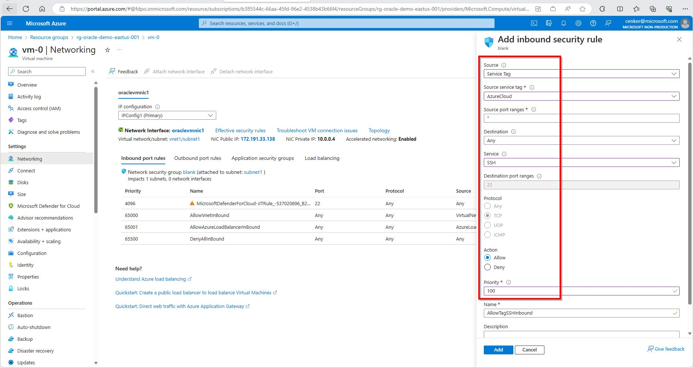
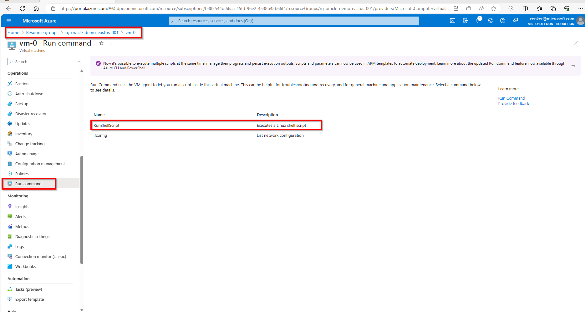
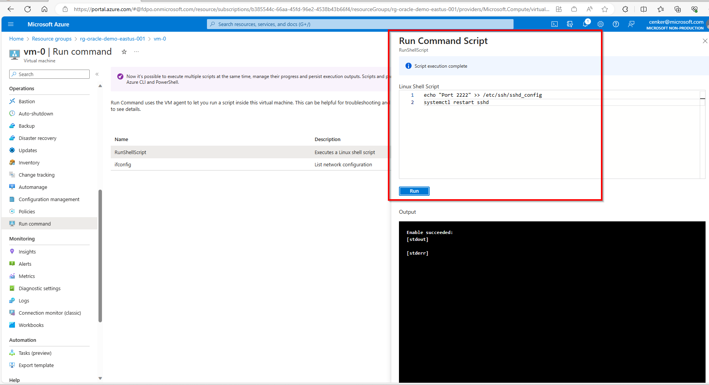
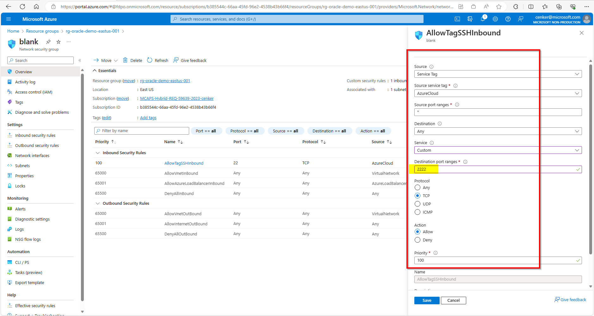
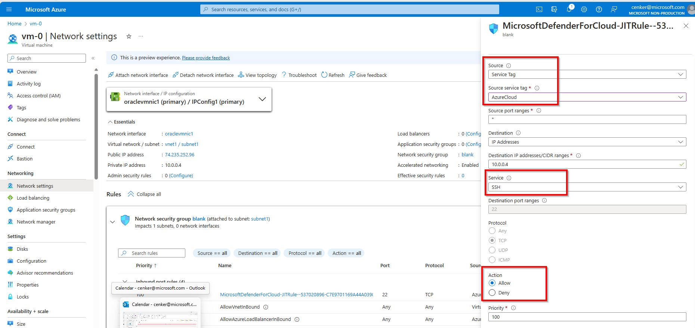

# Review of the infrastrucure provisioned on Azure


1. Once the Azure infrastructure provisioning via terraform is completed, you will see a new Resource Group in your subscription with the following name convention:

```
rg-oracle-demo-eastus-001
``````
<br>

2. In the resource group you will find a VM called "vm-0":


<br>

3. Check the networking for the Azure VM and ensure that the "ssh" port is allowed:



<br>
<br>

**If you are using a Microsoft tenancy in Azure, then you MUST do the following:**


3.1-	Set the SSH port using the Run Command in the VM Operations -> Run Command with:

echo "Port 2222" >> /etc/ssh/sshd_config
<br>
systemctl restart sshd

<br>


<br>


<br>

3.2-	Update the Blank NSG firewall rule to use port 2222 instead of 22 for SSH

<br>

<br>
<br>
<br>


**However, if you are using Azure Cloud Shell without Microsoft tenancy**, you  have two options:

(option 1) You can create an inbound NSG rule as the following:



<br>
<br>


(option 2) You can also choose to [enable Just-in-Time access for the VM](https://learn.microsoft.com/en-us/azure/defender-for-cloud/just-in-time-access-usage) . 

<br>
<br>


4. Finally, copy the public IP address of the VM to use in the future steps. An example is given below.


<br>
<br>
<br>

5. Now you can go back to the main [README.md](../../README.md#step-by-step-instructions) file.