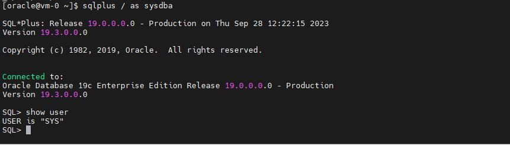

# Testing the final configuration


1. From the compute source (or Azure Cloud Shell), ssh into the Azure VM:
```
ssh -i ~/.ssh/lza-oracle-single-instance  oracle@<PUBLIC_IP_ADDRESS>
```
<br>

If you modified SSH port to 2222, do the following instead:
```
ssh -i ~/.ssh/lza-oracle-single-instance  oracle@<PUBLIC_IP_ADDRESS> -p 2222
```
<br>

2. Check the Oracle related environment variables:
```
env | grep -i oracle
```
<br>
3. Connect to the database:

```
sqlplus / as sysdba
SQL> show user
```
<br>



<br>

Congratulations!!! Now, you have a functional Oracle DB running on the Azure VM.