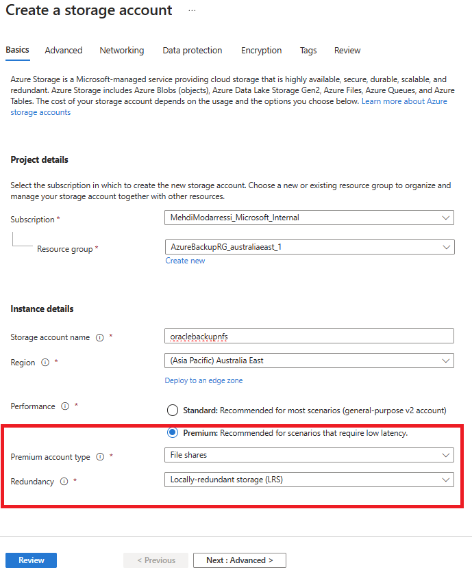
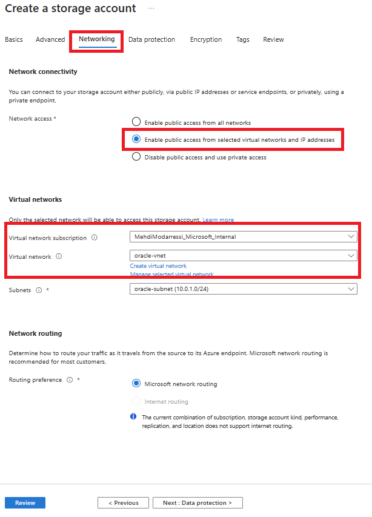
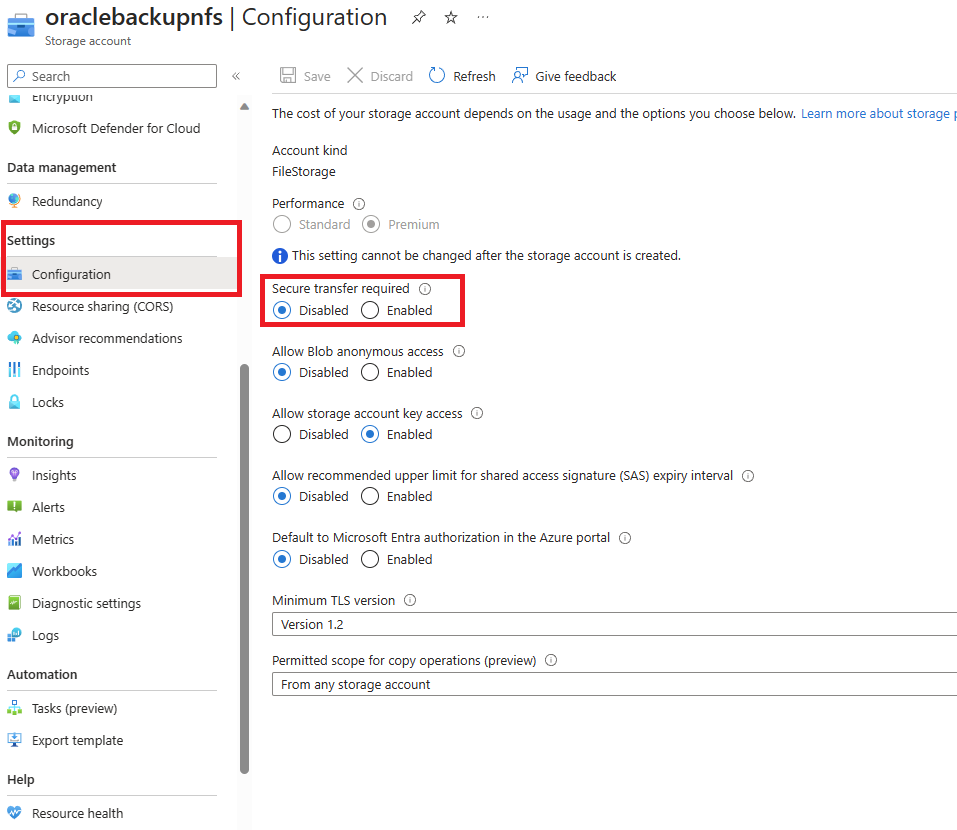
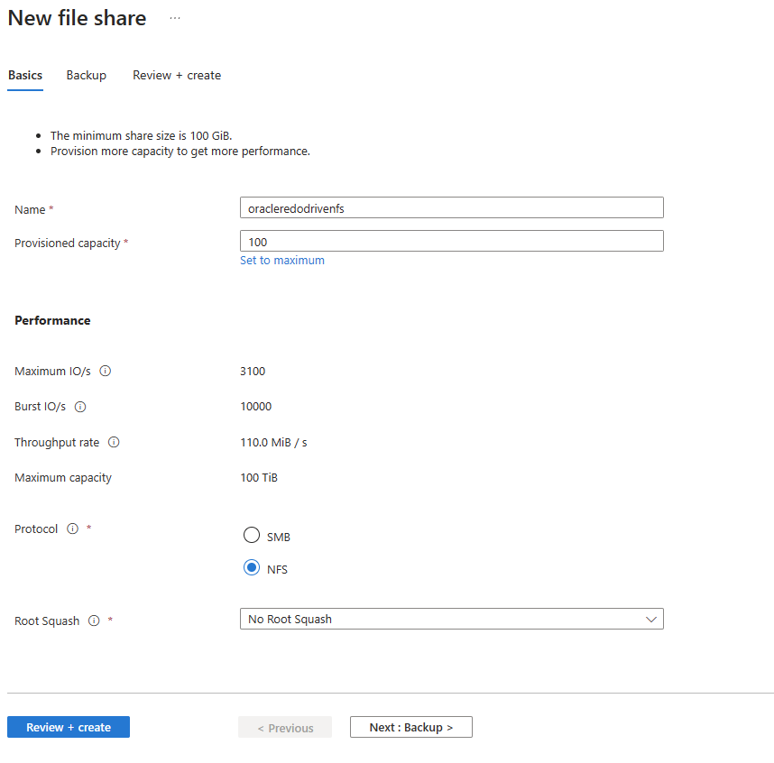
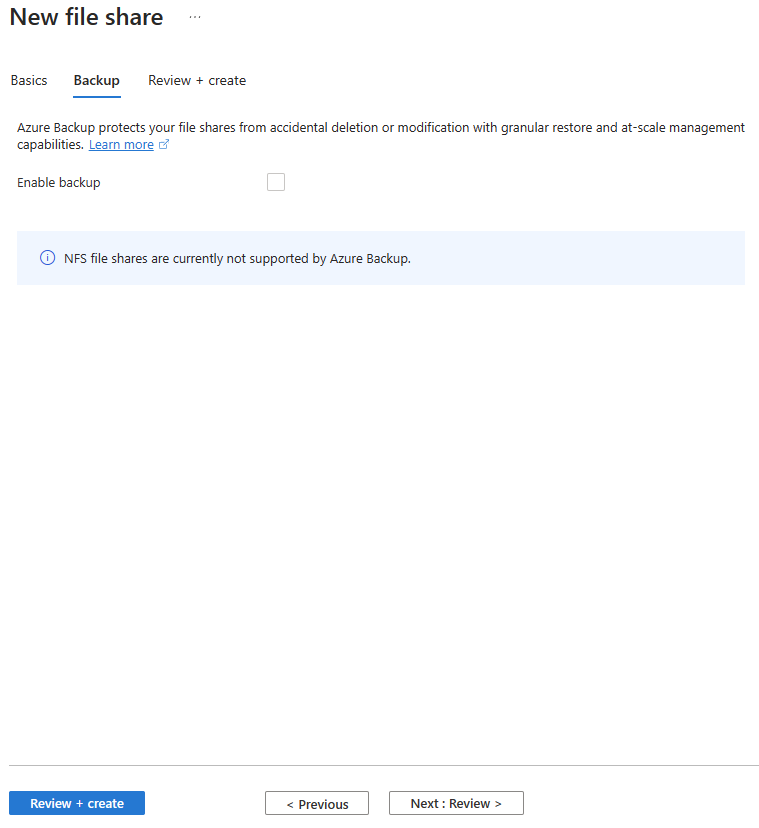
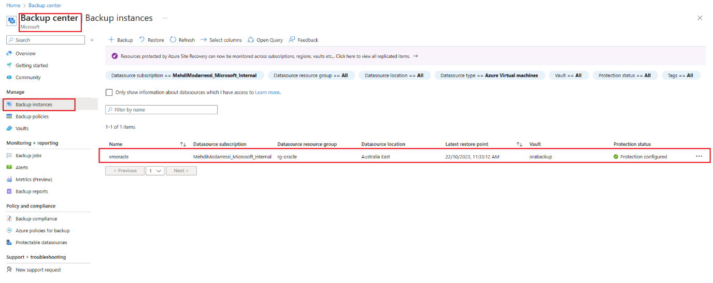
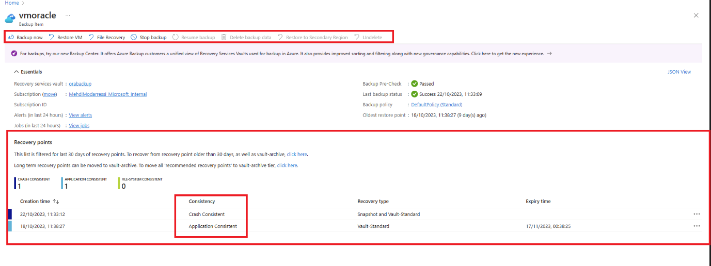
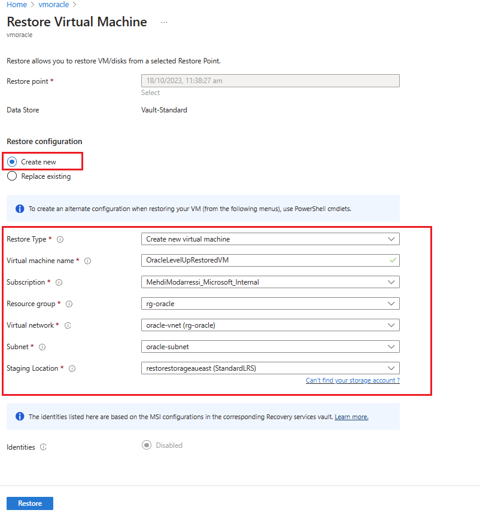

- [Lab-3: Backup](#lab-3-backup)
  - [Pre-requisites](#pre-requisites)
  - [Introduction](#introduction)
  - [Prepare the environment:](#prepare-the-environment)
    - [Connect to the Oracle VM:](#connect-to-the-oracle-vm)
  - [Setup Azure Files storage for the Oracle redo log
    files](#setup-azure-files-storage-for-the-oracle-redo-log-files)
    - [Create and Azure Premium File Share Storage
      account](#create-and-azure-premium-file-share-storage-account)
    - [Create a File share](#create-a-file-share)
    - [Mount the File Share in Oracle
      VM](#mount-the-file-share-in-oracle-vm)
    - [Prepare the database](#prepare-the-database)
  - [Back up your data by using Azure
    Backup](#back-up-your-data-by-using-azure-backup)
    - [Understand the Azure Backup
      framework](#understand-the-azure-backup-framework)
    - [Prepare the environment for an application-consistent
      backup](#prepare-the-environment-for-an-application-consistent-backup)
    - [Set up application-consistent
      backups](#set-up-application-consistent-backups)
  - [Trigger an application-consistent backup of the
    VM](#trigger-an-application-consistent-backup-of-the-vm)
  - [Restore the VM](#restore-the-vm)
  - [Recover the database](#recover-the-database)

# Lab-3: Backup

## Pre-requisites

- PowerShell 5.1 or above is required. PowerShell 5.1 comes preinstalled
  with Windows 10 and Windows 11. For more information refer to
  https://learn.microsoft.com/en-us/powershell/scripting/windows-powershell/install/installing-windows-powershell

- Azure CLI 2.40 or above is required. Setup script will automatically
  install the latest version, or you can manually install Azure CLI from
  <https://learn.microsoft.com/en-us/cli/azure/install-azure-cli-windows?tabs=azure-cli>

## Introduction

This lab will demonstrate the use of Azure Backup to take application
consistent backups of the Oracle Database. By Using Azure backup, you
can take full disk snapshots which are application consistent for the
RDBMS and are stored in [Recovery Services
vault](https://learn.microsoft.com/en-us/azure/backup/backup-azure-recovery-services-vault-overview).

Azure Backup also provides application-consistent backups, which ensure
that more fixes aren't required to restore the data.
Application-consistent backups work with both file system and Oracle
Automatic Storage Management (ASM) databases.

Restoring application-consistent data reduces restoration time, so you
can quickly return to a running state. Oracle Database recovery is still
necessary after restoring. You facilitate the recovery by using Oracle
archived redo log files that are captured and stored in a separate Azure
file share.

## Prepare the environment:

### Connect to the Oracle VM:

1.  To create a Secure Shell (SSH) session with the VM, use the
    following command. Replace \<publicIpAddress\> with the public
    address value for your VM.

<!-- -->

    ssh azureuser@<publicIpAddress>

2.  Switch to root user:

<!-- -->

    sudo su –

3.  Add the oracle user to the `/etc/sudoers` file:

<!-- -->

    echo "oracle   ALL=(ALL)      NOPASSWD: ALL" >> /etc/sudoers

## Setup Azure Files storage for the Oracle redo log files

The Oracle Database instance's archived redo log files play a crucial
role in database recovery. They store the committed transactions needed
to roll forward from a database snapshot taken in the past.

For instance, if the application consistent backup was taken at 2pm and
there was an outage at 4pm without ***Archived Redo Logs*** the database
could be restored to the latest snapshot backup which was 2pm. Azure
Backup, even with enhanced policy can only do maximum of 6 backups a day
and hence an RPO of 4 hours.

When the database is in `ARCHIVELOG` mode, it archives the contents of
online redo log files when they become full and switch. Together with a
backup, they're required to achieve point-in-time recovery when the
database is lost.

Oracle provides the capability to archive redo log files to different
locations. The industry best practice is that at least one of those
destinations should be on remote storage, so it's separate from the host
storage and protected with independent snapshots. Azure Files meets
those requirements.

An Azure file share is a storage that you attach to a Linux or Windows
VM as a regular file-system component, by using the Server Message Block
(SMB) or Network File System (NFS) protocol. In this lab we setup an
Azure premium file share using NFS protocol and use it as a remote
storage for Archived Redo Log files of the RDBMS.

### Create and Azure Premium File Share Storage account

1.  On basics tab

    1.  Create a storage account.

    2.  Type in a storage account name.

    3.  For performance select **Premium.**

    4.  For account type select **File Share.**

    5.  Leave the rest as default.

2.  On Networking tab

    1.  Change network access to: **Enable Public access from selected
        virtual networks and IP addresses**

    2.  Select the Vnet and Subnet of your Oracle VM

3.  Finally **Review and Create**

### Create a File share

Once the premium file share storage account is created, go to the
resource.

1.  From left hand menu go to properties and disable “**Secure transfer
    required**” option.

> *NFS protocol does not support secure transfer.*

2.  Click on file share and create new file share

3.  On Basics Tap

    1.  Type in a name

    2.  Change provisioned capacity to **100**

    3.  Change protocol to NFS

    4.  Leave the reset

4.  On Backup tab remove the tick for “Enable Backup”

> ***Note:** For resiliency purposes, it is always good practice to have
> your File Share to **ZRS** and have the backup option **Enabled**. But
> for lab purposes and to save resources we disabled backups and set our
> Redundancy to LRS.*

### Mount the File Share in Oracle VM

1.  Install `nfs-utils` package

<!-- -->

    sudo yum install nfs-utils

2.  Create the mount point directory

<!-- -->

    sudo mkdir -p /mnt/orabackup

3.  Run the commands to mount the Azure file share by using the SMB
    protocol, substitute `<Your Storage Account Name>` and
    `<File share name>` with the values of the NFS file share created
    earlier.

<!-- -->

    sudo mount -t nfs <storage account name>.file.core.windows.net:/<storage account name>/<NFS File share name> /mnt/orabackup -o vers=4,minorversion=1,sec=sys,uid=oracle,gid=oinstall,dir_mode=0777,file_mode=0777

4.  Add the mount to the /etc/fstab file:, substitute
    `<Your Storage Account Name``>` and `<File share name>` with the
    values of the NFS file share created earlier.

<!-- -->

    sudo bash -c ‘echo <storage account name>.file.core.windows.net:/<storage account name>/<File share name> /mnt/orabackup nfs -o vers=4,minorversion=1,sec=sys,uid=oracle,gid=oinstall,dir_mode=0777,file_mode=0777 0 0

5.  Check that the file share is mounted properly by using the following
    command:

<!-- -->

    df -h

The output should look like this example:

    $ df -h
    Filesystem                                    Size  Used Avail Use% Mounted on
    devtmpfs                                      3.3G     0  3.3G   0% /dev
    tmpfs                                         3.3G     0  3.3G   0% /dev/shm
    tmpfs                                         3.3G   17M  3.3G   1% /run
    tmpfs                                         3.3G     0  3.3G   0% /sys/fs/cgroup
    /dev/sda2                                      30G  9.1G   19G  34% /
    /dev/sdc1                                      59G  2.7G   53G   5% /u02
    /dev/sda1                                     497M  199M  298M  41% /boot
    /dev/sda15                                    495M  9.7M  486M   2% /boot/efi
    tmpfs                                         671M     0  671M   0% /run/user/54321
    /dev/sdb1                                      14G  2.1G   11G  16% /mnt/resource
    tmpfs                                         671M     0  671M   0% /run/user/54322
    //orabackup.file.core.windows.net/orabackup   10T     0   10T   0% /mnt/orabackup

### Prepare the database

This part of the process assumes that you followed [Create an Oracle
Database instance in an Azure
VM](https://learn.microsoft.com/en-us/azure/virtual-machines/workloads/oracle/oracle-database-quick-create).
As a result:

- You have an Oracle instance named oratest1 that's running on a VM
  named vmoracle19c.

- You're using the standard Oracle `oraenv` script with its dependency
  on the standard Oracle configuration file `/etc/oratab` to set up
  environment variables in a shell session.

Perform the following steps for each database on the VM:

1.  Switch to the oracle user:

<!-- -->

    sudo su - oracle

2.  Set the environment variable `ORACLE_SID` by running
    the `oraenv` script. It will prompt you to enter
    the `ORACLE_SID` name.

<!-- -->

    . oraenv

3.  Add the Azure file share as another destination for database archive
    log files.

This step assumes that you configured and mounted an Azure file share on
the Linux VM. For each database installed on the VM, make a subdirectory
that's named after your database security identifier (SID).

In this example, the mount point name is `/``mnt/orabackup` and the SID
is `oratest1`. So you create the
subdirectory `/mnt/orabackup/oratest1` and change ownership to
the oracle user. Substitute `/mnt/orabackup/oratest1`` `for your mount
point name and database SID.

    sudo mkdir /mnt/orabackup/oratest1
    sudo chown oracle:oinstall /mnt/orabackup

4.  Connect to the database:

<!-- -->

    sqlplus / as sysdba

5.  Start the database if it's not already running:

<!-- -->

    SQL> startup

6.  Set the first archive log destination of the database to the
    file-share directory that you created earlier:

<!-- -->

    SQL> alter system set log_archive_dest_1='LOCATION=/mnt/orabackup' scope=both;

7.  Define the recovery point objective (RPO) for the database.

To achieve a consistent RPO, consider the frequency at which the online
redo log files will be archived. These factors control the frequency:

- The size of the online redo log files. As an online log file becomes
  full, it's switched and archived. The larger the online log file, the
  longer it takes to fill up. The added time decreases the frequency of
  archive generation.

- The setting of the `ARCHIVE_LAG_TARGET` parameter controls the maximum
  number of seconds permitted before the current online log file must be
  switched and archived.

To minimize the frequency of switching and archiving, along with the
accompanying checkpoint operation, Oracle online redo log files
generally have a large size (for example, 1,024M, 4,096M, or 8,192M). In
a busy database environment, logs are still likely to switch and archive
every few seconds or minutes. In a less active database, they might go
hours or days before the most recent transactions are archived, which
would dramatically decrease archival frequency.

We recommend that you set `ARCHIVE_LAG_TARGET `to ensure a consistent
RPO. A setting of 5 minutes (300 seconds) is a prudent value
for `ARCHIVE_LAG_TARGET`. It ensures that any database recovery
operation can recover to within 5 minutes of the time of failure.

To set `ARCHIVE_LAG_TARGET`, run this command:

    SQL> alter system set archive_lag_target=300 scope=both;

To better understand how to deploy highly available Oracle Database
instances in Azure with zero RPO, see [Reference architectures for
Oracle
Database](https://learn.microsoft.com/en-us/azure/virtual-machines/workloads/oracle/oracle-reference-architecture).

8.  Make sure the database is in archive log mode to enable online
    backups.

Check the log archive status first:

    SQL> SELECT log_mode FROM v$database;
    LOG_MODE
    ------------
    NOARCHIVELOG

If it's in `NOARCHIVELOG` mode, run the following commands:

    SQL> SHUTDOWN IMMEDIATE;
    SQL> STARTUP MOUNT;
    SQL> ALTER DATABASE ARCHIVELOG;
    SQL> ALTER DATABASE OPEN;
    SQL> ALTER SYSTEM SWITCH LOGFILE;

9.  Create a table to test the backup and restore operations:

<!-- -->

    SQL> create user scott identified by tiger quota 100M on users;
    SQL> grant create session, create table to scott;
    SQL> connect scott/tiger
    SQL> create table scott_table(col1 number, col2 varchar2(50));
    SQL> insert into scott_table VALUES(1,'Line 1');
    SQL> commit;
    SQL> quit

10. Force Archive redo log to make sure online redo logs are archived to
    the NFS file share

<!-- -->

    SQL> sqlplus / as sysdba
    SQL> ALTER SYSTEM  SWITCH LOGFILE;
    SQL> quit

11. Return to bash and check if there are files created in NFS mount
    point

<!-- -->

    sudo ls -lrt /mnt/orabackup/oratest1

12. The result should look like this:

<!-- -->

    total 6058816
    -rw-r-----. 1 oracle oinstall   1904128 Oct 17 15:09 1_9_1150425766.dbf
    -rw-r-----. 1 oracle oinstall     16384 Oct 17 15:09 1_10_1150425766.dbf
    -rw-r-----. 1 oracle oinstall    587776 Oct 17 15:10 1_11_1150425766.dbf
    -rw-r-----. 1 oracle oinstall   1847808 Oct 17 15:10 1_12_1150425766.dbf
    -rw-r-----. 1 oracle oinstall     31744 Oct 17 15:15 1_13_1150425766.dbf
    -rw-r-----. 1 oracle oinstall      4608 Oct 17 15:20 1_14_1150425766.dbf
    -rw-r-----. 1 oracle oinstall   8676352 Oct 17 15:25 1_15_1150425766.dbf
    -rw-r-----. 1 oracle oinstall     90112 Oct 17 15:30 1_16_1150425766.dbf
    -rw-r-----. 1 oracle oinstall     19968 Oct 17 15:35 1_17_1150425766.dbf
    -rw-r-----. 1 oracle oinstall     26624 Oct 17 15:40 1_18_1150425766.dbf

> ***Note:** If there are no files created that indicates a problem with
> Oracle ability to write to the mount point and needs to be fixed. You
> can navigate to the /mnt/orabackup and try creating a file as Oracle
> user to test if there are any potential issues.*

## Back up your data by using Azure Backup

The Azure Backup service provides solutions to back up your data and
recover it from the Microsoft Azure cloud. Azure Backup provides
independent and isolated backups to guard against accidental destruction
of original data. Backups are stored in a Recovery Services vault with
built-in management of recovery points, so you can restore as needed.

In this section, you use Azure Backup to take application-consistent
snapshots of your running VM and Oracle Database instances. The
databases are placed into backup mode, which allows a transactionally
consistent online backup to occur while Azure Backup takes a snapshot of
the VM disks. The snapshot is a full copy of the storage and not an
incremental or copy-on-write snapshot. It's an effective medium to
restore your database from.

The advantage of using Azure Backup application-consistent snapshots is
that they're fast to take, no matter how large your database is. You can
use a snapshot for restore operations as soon as you take it, without
having to wait for it to be transferred to the Recovery Services vault.

### Understand the Azure Backup framework

The Azure Backup service provides
a [framework](https://learn.microsoft.com/en-us/azure/backup/backup-azure-linux-app-consistent) to
achieve application consistency during backups of Windows and Linux VMs
for various applications. This framework involves invoking a pre-script
to quiesce the applications before taking a snapshot of disks. It calls
a post-script to unfreeze the applications after the snapshot is
completed.

Microsoft has enhanced the framework so that the Azure Backup service
provides packaged pre-scripts and post-scripts for selected
applications. These pre-scripts and post-scripts are already loaded on
the Linux image, so there's nothing for you to install. You just name
the application, and then Azure Backup automatically invokes the
relevant scripts. Microsoft manages the packaged pre-scripts and
post-scripts, so you can be assured of the support, ownership, and
validity of them.

Currently, the supported applications for the enhanced framework are
Oracle 12.x or later and MySQL. For details, see [Support matrix for
managed Azure VM
backups](https://learn.microsoft.com/en-us/azure/backup/backup-support-matrix-iaas).

You can author your own scripts for Azure Backup to use with pre-12.x
databases. Example scripts are available
on [GitHub](https://github.com/Azure/azure-linux-extensions/tree/master/VMBackup/main/workloadPatch/DefaultScripts).

Each time you do a backup, the enhanced framework runs the pre-scripts
and post-scripts on all Oracle Database instances installed on the VM.
The `configuration_path` parameter in the `workload.conf` file points to
the location of the Oracle `/etc/oratab` file (or a user-defined file
that follows the oratab syntax). For details, see [Set up
application-consistent
backups](https://learn.microsoft.com/en-us/azure/virtual-machines/workloads/oracle/oracle-database-backup-azure-backup?tabs=azure-portal#set-up-application-consistent-backups).

Azure Backup runs the pre-scripts and post-scripts for each database
listed in the file that `configuration_path` points to. Exceptions are
lines that begin with # (treated as comment) or +ASM (an Oracle ASM
instance).

The Azure Backup enhanced framework takes online backups of Oracle
Database instances that operate in `ARCHIVELOG` mode. The pre-scripts
and post-scripts use
the `ALTER DATABASE BEGIN `and `END BACKUP` commands to achieve
application consistency.

For the database backup to be consistent, databases
in `NOARCHIVELOG` mode must be shut down cleanly before the snapshot
starts.

### Prepare the environment for an application-consistent backup

Oracle Database employs job role separation to provide separation of
duties by using least privilege. It associates separate operating system
(OS) groups with separate database administrative roles. Users can then
have different database privileges granted to them, depending on their
membership in OS groups.

The `SYSBACKUP` database role (generic name `OSBACKUPDBA`) provides
limited privileges to perform backup operations in the database. Azure
Backup requires it.

During Oracle installation, we recommend that you use `backupdba` as the
OS group name to associate with the `SYSBACKUP` role. But you can use
any name, so you need to determine the name of the OS group that
represents the Oracle `SYSBACKUP` role first.

1.  Switch to the oracle user:

<!-- -->

    sudo su - oracle

2.  Set the Oracle environment:

<!-- -->

    export ORACLE_SID=oratest1
    export ORAENV_ASK=NO
    . oraenv

3.  Determine the name of the OS group that represents the
    Oracle `SYSBACKUP` role:

<!-- -->

    grep "define SS_BKP" $ORACLE_HOME/rdbms/lib/config.c

The output looks like the following example:

    #define SS_BKP_GRP "backupdba"

In the output, the value enclosed within double quotation marks is the
name of the Linux OS group to which the Oracle `SYSBACKUP` role is
externally authenticated. In this example, it's `backupdba`. Note down
the actual value.

4.  Verify that the OS group exists by running the following command.
    Substitute `<group name>` with the value that the previous command
    returned (without the quotation marks).

<!-- -->

    grep <group name> /etc/group

The output looks like the following example:

    backupdba:x:54324:oracle

> *** Important***
>
> *If the output doesn't match the Oracle OS group value that you
> retrieved in step 3, use the following command to create the OS group
> that represents the Oracle SYSBACKUP role. Substitute \<group
> name\> with the group name that you retrieved in step 3.*

    sudo groupadd <group name>

5.  Create a new backup user named `azbackup` that belongs to the OS
    group that you verified or created in the previous steps.
    Substitute `<group name>` with the name of the verified group. The
    user is also added to the `oinstall` group to enable it to open ASM
    disks.

<!-- -->

    sudo useradd -g <group name> -G oinstall azbackup 

6.  Set up external authentication for the new backup user.

The backup user `azbackup` needs to be able to access the database by
using external authentication, so it isn't challenged by a password. To
enable this access, you must create a database user that authenticates
externally through `azbackup`. The database uses a prefix for the
username, which you need to find.

Perform the following steps for each database installed on the VM:

1.  Log in to the database by using SQL Plus, and check the default
    settings for external authentication:

<!-- -->

    sqlplus / as sysdba
    SQL> show parameter os_authent_prefix
    SQL> show parameter remote_os_authent

The output should look like this example, which shows ops\$ as the
database username prefix:

    NAME                                 TYPE        VALUE
    ------------------------------------ ----------- ------------------------------
    os_authent_prefix                    string      ops$
    remote_os_authent                    boolean     FALSE

2.  Create a database user named ops\$azbackup for external
    authentication to the azbackup user, and grant SYSBACKUP privileges:

<!-- -->

    SQL> CREATE USER ops$azbackup IDENTIFIED EXTERNALLY;
    SQL> GRANT CREATE SESSION, ALTER SESSION, SYSBACKUP TO ops$azbackup;

7.  If you receive the error ORA-46953: The password file is not in the
    12.2 format when you run the GRANT statement, follow these steps to
    migrate the *orapwd* file to 12.2 format. Perform these steps for
    every Oracle Database instance on the VM.

    1.  Exit SQL Plus.

    2.  Move the password file with the old format to a new name.

    3.  Migrate the password file.

    4.  Remove the old file.

    5.  Run the following commands:

<!-- -->

    mv $ORACLE_HOME/dbs/orapworatest1 $ORACLE_HOME/dbs/orapworatest1.tmp
    orapwd file=$ORACLE_HOME/dbs/orapworatest1 input_file=$ORACLE_HOME/dbs/orapworatest1.tmp
    rm $ORACLE_HOME/dbs/orapworatest1.tmp

6.  Rerun the GRANT operation in SQL Plus.

<!-- -->

8.  Create a stored procedure to log backup messages to the database
    alert log. Use the following code for each database installed on the
    VM:

<!-- -->

    sqlplus / as sysdba
    SQL> GRANT EXECUTE ON DBMS_SYSTEM TO SYSBACKUP;
    SQL> CREATE PROCEDURE sysbackup.azmessage(in_msg IN VARCHAR2)
    AS
      v_timestamp     VARCHAR2(32);
    BEGIN
      SELECT TO_CHAR(SYSDATE, 'YYYY-MM-DD HH24:MI:SS')
      INTO v_timestamp FROM DUAL;
      DBMS_OUTPUT.PUT_LINE(v_timestamp || ' - ' || in_msg);
      SYS.DBMS_SYSTEM.KSDWRT(SYS.DBMS_SYSTEM.ALERT_FILE, in_msg);
    END azmessage;
    /
    SQL> SHOW ERRORS
    SQL> QUIT

### Set up application-consistent backups

1.  Switch to the root user:

<!-- -->

    sudo su -

2.  Check for the `/etc/azure` folder. If it isn't present, create the
    working directory for the application-consistent backup:

<!-- -->

    if [ ! -d "/etc/azure" ]; then
       mkdir /etc/azure
    fi

3.  Check for the `workload.conf` file within the folder. If it isn't
    present, create it in the `/etc/azure` directory and give it the
    following contents. The comments must begin with \[workload\]. If
    the file is already present, just edit the fields so that they match
    the following contents. Otherwise, the following command creates the
    file and populates the contents:

<!-- -->

    echo "[workload]
    workload_name = oracle
    configuration_path = /etc/oratab
    timeout = 90
    linux_user = azbackup" > /etc/azure/workload.conf

The `workload.conf` file uses the following format:

- The `workload_name` parameter indicates the database workload type. In
  this case, setting the parameter to Oracle allows Azure Backup to run
  the correct pre-scripts and post-scripts (consistency commands) for
  Oracle Database instances.

<!-- -->

- The timeout parameter indicates the maximum time, in seconds, that
  each database must complete storage snapshots.

<!-- -->

- The `linux_user` parameter indicates the Linux user account that Azure
  Backup uses to run database quiesce operations. You created this
  user, `azbackup`, previously.

<!-- -->

- The `configuration_path` parameter indicates the absolute path name
  for a text file on the VM. Each line lists a database instance running
  on the VM. This is typically the `/etc``/``oratab` file that Oracle
  generates during database installation, but it can be any file with
  any name that you choose. It must follow these format rules:

  - The file is a text file. Each field is delimited with the colon
    character (:).

  <!-- -->

  - The first field in each line is the name for an ORACLE_SID instance.

  <!-- -->

  - The second field in each line is the absolute path name
    for ORACLE_HOME for that ORACLE_SID instance.

  <!-- -->

  - All text after the first two fields is ignored.

  <!-- -->

  - If the line starts with a pound sign (#), the entire line is ignored
    as a comment.

  <!-- -->

  - If the first field has the value +ASM, denoting an Oracle ASM
    instance, it's ignored.

## Trigger an application-consistent backup of the VM

This section uses Azure CLI but similar steps could be completed through
Azure portal

1.  Create a Recovery Services vault:

<!-- -->

    az backup vault create --location <LOCATION OF RESOURCES> --name myVault --resource-group <RG NAME>

2.  Enable backup protection for the VM:

<!-- -->

    az backup protection enable-for-vm \
       --resource-group <RG NAME> \
       --vault-name myVault \
       --vm <Oracle VM NAME> \
       --policy-name DefaultPolicy

3.  Trigger a backup to run now rather than waiting for the backup to
    run at the default schedule (5:00 AM UTC):

<!-- -->

    az backup protection backup-now \
       --resource-group <RG NAME>\
       --vault-name myVault \
       --backup-management-type AzureIaasVM \
       --container-name vmoracle19c \
       --item-name vmoracle19c 

4.  Monitor the progress of the backup job by
    using `az backup job list` `and az backup job show`.

## Restore the VM

Restoring an entire VM means that you restore the VM and its attached
disks to a new VM from a selected restore point. This action also
restores all databases that run on the VM. Afterward, you need to
recover each database.

There are two main choices when you're restoring a VM:

- Restore the VM from which the backups were originally taken.

- Restore (clone) a new VM without affecting the VM from which the
  backups were originally taken.

> **Pre-requisites: Create a GPV2 Storage account in the same region as
> your VM.**

In this exercise we restore the VM to a new VM without affecting the
source (primary VM).

1.  From portal go to “Backup Center”

2.  From left hand menu select “Backup instances”

3.  From the list find you Oracle VM and click on it to view details

4.  On this page you can initiate a new backup, Start restore, or file
    recovery. Also you can see the list of backups and their type.

5.  Select the latest Application consistent backup and using the
    ellipsis (**...**) select “Restore VM”

6.  On the restore page select

    1.  “Create New”

    2.  Give the new VM a name

    3.  Select you Resource Group

    4.  Virtual Network and Subnet

> ***Note:** Recommended to use the same Vnet and subnet as the Premium
> File Share’s firewall is already configured for this Vnet/Subnet.
> Otherwise, you can create or select another Vnet/Subnet but make sure
> to configure the File Share Storage Account’s firewall accordingly.*

5.  Select the storage account that you created earlier on this step as
    the “Staging Location”

6.  Hit “Restore”

After this step it will take some time and your new VM will be created.
In the next and final step you will recover the database.

## Recover the database

1.  Connect to the restored VM.

<!-- -->

    ssh azureuser@<publicIpAddress>

> **Note:** The Username/password(or ssh key) is the same as the
> original VM.

2.  Double check that the NFS file share is mounted correctly.

>     sudo ls -lrt /mnt/orabackup/oratest1
>
>     OR
>
>     df -h

When the whole VM has been restored, it's important to recover the
databases on the VM by performing the following steps on each database.

3.  You might find that the instance is running, because the autostart
    attempted to start the database on VM startup. However, the database
    requires recovery and is likely to be at the mount stage only. Run a
    preparatory shutdown before starting the mount stage:

<!-- -->

    sudo su - oracle
    sqlplus / as sysdba
    SQL> shutdown immediate
    SQL> startup mount

4.  Perform database recovery.

It's important to specify the `USING BACKUP CONTR`OLFILE syntax to
inform the `RECOVER AUTOMATIC DATABASE` command that recovery should not
stop at the Oracle system change number (SCN) recorded in the restored
database control file.

The restored database control file was a snapshot, along with the rest
of the database. The `SCN` stored within it is from the point in time of
the snapshot. There might be transactions recorded after this point, and
you want to recover to the point of the last transaction committed to
the database.

    SQL> recover automatic database using backup controlfile until cancel;

5.  When the last available archive log file has been applied,
    enter `CANCEL` to end recovery.

<!-- -->

    SQL> recover automatic database until cancel using backup controlfile;
    ORA-00279: change 2172930 generated at 04/08/2021 12:27:06 needed for thread 1
    ORA-00289: suggestion :
    /u02/fast_recovery_area/ORATEST1/archivelog/2021_04_08/o1_mf_1_13_%u_.arc
    ORA-00280: change 2172930 for thread 1 is in sequence #13
    ORA-00278: log file
    '/u02/fast_recovery_area/ORATEST1/archivelog/2021_04_08/o1_mf_1_13_%u_.arc' no
    longer needed for this recovery
    ORA-00308: cannot open archived log
    '/u02/fast_recovery_area/ORATEST1/archivelog/2021_04_08/o1_mf_1_13_%u_.arc'
    ORA-27037: unable to obtain file status
    Linux-x86_64 Error: 2: No such file or directory
    Additional information: 7

    Specify log: {<RET>=suggested | filename | AUTO | CANCEL}

6.  Open the database.

The `RESETLOGS` option is required when the `RECOVER` command uses
the `USING BACKUP` `CONTROLFILE` option. `RESETLOGS` creates a new
incarnation of the database by resetting the redo history back to the
beginning, because there's no way to determine how much of the previous
database incarnation was skipped in the recovery.

    SQL> alter database open resetlogs;

7.  Check that the database content was recovered:

<!-- -->

    SQL> select * from scott.scott_table;

The backup and recovery of Oracle Database on an Azure Linux VM are now
finished.
