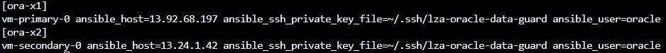

# Configure Oracle DB single instance via Ansible

On the compute source running Ubuntu or on Azure Cloud Shell, follow the steps given below:

1. Switch to the oracle subdirectory:

```bash
cd ~/lza-oracle/ansible/bootstrap/oracle
```

1. Create a new file called inventory and populate it with the following content. Replace <hostname> and <Public IP address of the Azure VM created via terraform> with the appropriate values before running the command:

```bash
cat > inventory <<EOF
[ora-x1]
<hostname for the primary node> ansible_host=<Public IP address of the primary node created via terraform or Bicep>  ansible_ssh_private_key_file=~/.ssh/lza-oracle-data-guard ansible_user=oracle
[ora-x2]
<hostname for the secondary node> ansible_host=<Public IP address of the secondary node created via terraform or Bicep>   ansible_ssh_private_key_file=~/.ssh/lza-oracle-data-guard ansible_user=oracle
EOF
```

Below is an example of what the file should look like after running the above command:

 

1. Start the ansible playbook

```bash
ansible-playbook playbook_dg.yml -i inventory --extra-vars "data_guard=yes"
```

(If you are prompted for "are you sure you want to continue connecting?", enter "yes")

(If using Azure Cloud Shell, remember to refresh your browser by scrolling up or down, every 15 minutes or so since the shell times out after 20 minutes of inaction.)

1. If you get an error stating "ERROR! Invalid callback for stdout specified: community.general.yaml" then run the following step and then re-run the previous step.

```bash
ansible-galaxy collection install community.general
```

1. It is acceptable to see warnings highlighted in red.


Once the installation and configuration completes, you will see a screen similar to the one below.


The installation has now completed and you can connect to the database.
