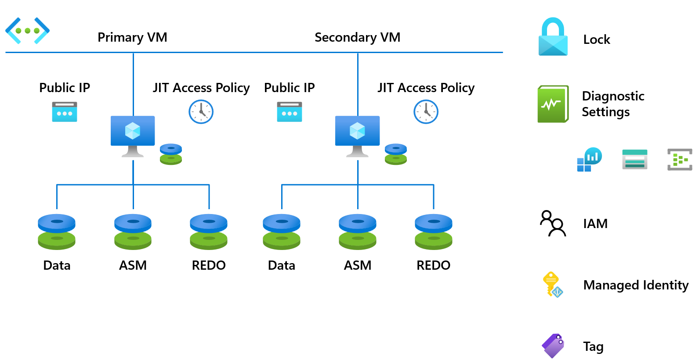

# Introduction

The code is intended as an example for automated deployment of two Azure Virtual Machines with Oracle Database Enterprise Edition 19c in a Data Guard configuration using Github Actions. The code is intended to be used as a starting point for your own deployment. The Terraform module for this deployment is located in the `terraform/bootstrap/data_guard` directory, and the Ansible playbook is the `ansible/bootstrap/oracle/` directory.

 

## Terraform variables

Overall if you wish to modify one or more variables in the Terraform module, you can do so by modifying the `terraform/bootstrap/data_guard/variables_global.tf` or the `terraform/bootstrap/data_guard/variables_local.tf` file.

## Configure and run the workflow

First, configure your OpenID Connect as described [here](https://learn.microsoft.com/en-us/azure/developer/github/connect-from-azure?tabs=azure-portal%2Cwindows#use-the-azure-login-action-with-openid-connect).

Create a Github Secret in your repo with the name SSH_PRIVATE_KEY, containing the private key you wish to use for the deployment.

To deploy through GitHub actions, please refer to the [Data Guard GitHub Terraform workflow](../blob/main/.github/workflows/full-dg-tf-deploy.yml) and follow the guidance below.

- Modify the following values in [Data Guard GitHub Terraform workflow](../blob/main/.github/workflows/full-dg-tf-deploy.yml):
  - Change _AZ_LOCATION: "eastus"_, to your preferred Azure region
  - Change _AZ_RG_BASENAME: "Oracle-test"_, to your preferred resource group name.
  - Change _VM_PRIMARY_NAME: "vm-primary-0"_, to your preferred name for the primary node in the data guard configuration.
  - Change _VM_SECONDARY_NAME: "vm-secondary-0"_, to your preferred name for the secondary node in the data guard configuration.
- Go to GitHub actions and run the action *Deploy an Oracle DB in a Data Guard configuration on Azure with Terraform and Ansible*
