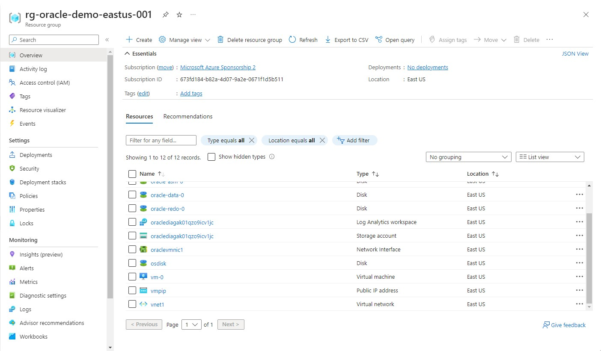
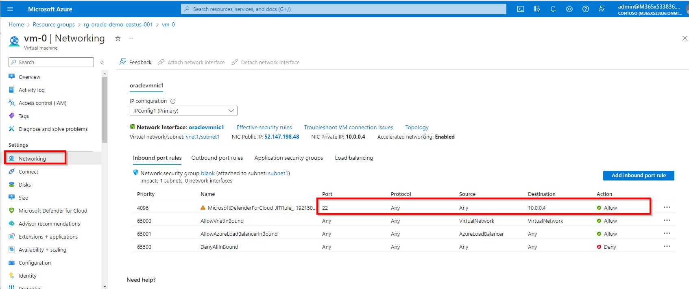

# Review of the infrastrucure provisioned on Azure


1. Once the Azure infrastructure provisioning via terraform is completed, you will see a new Resource Group in your subscription with the following name convention:

```
rg-oracle-demo-eastus-001
``````

2. In the resource group you will find a VM called "vm-0":




3. Check the networking for the Azure VM and ensure that the "ssh" port is allowed:




If you are using Azure Cloud Shell, you can create an inbound rule as the following:


4. Copy the public IP address of the VM to use in the future steps. An example is given below.


4. Now you can go back to the main [README.md](../../README.md#step-by-step-instructions) file.